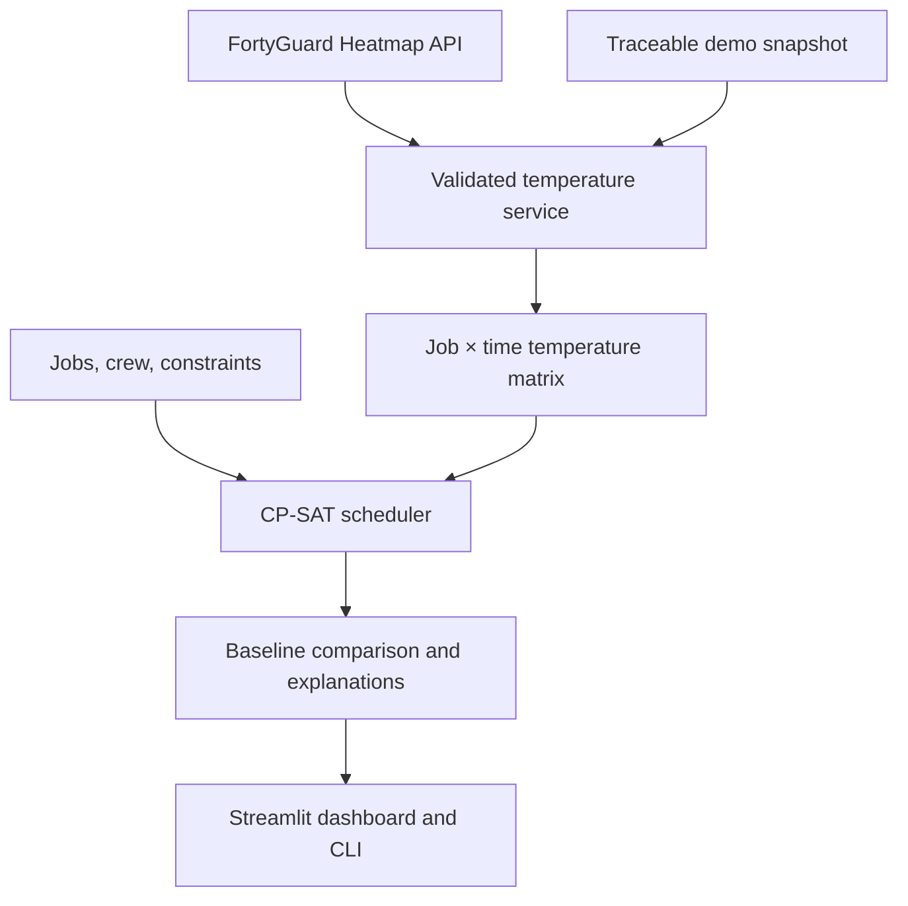

# HeatOps

[](https://github.com/MichelleHan7/HeatOps/actions/workflows/ci.yml)
[](https://www.python.org/)

**Heat-aware field operations planning powered by FortyGuard hyperlocal
temperature intelligence.**

HeatOps turns location- and time-specific temperature data into an actionable
field schedule. It compares an operations-first baseline with a heat-aware
schedule, makes the heat-versus-delay trade-off explicit, and explains every
job that moved.

The current demo models one Phoenix utility crew and five field jobs. On the
bundled, traceable FortyGuard snapshot, the **Heat-first** preset reduces the
operational Heat Load Score from **40.38 to 39.18 (2.97%)** by moving **3 of 5
jobs**. Heat Load is a planning metric, not a medical risk assessment.

## Demo highlights

- A polished Streamlit dashboard with preset and custom optimization controls.
- Side-by-side baseline and optimized timelines.
- Hyperlocal temperature curves and a field-location map.
- A visible Heat Load, delay, idle-time, and threshold-exposure comparison.
- Plain-language, job-level explanations for every scheduling change.
- Optional live FortyGuard refresh with validated cache and snapshot fallback.
- A deterministic OR-Tools CP-SAT optimizer and a fair, temperature-unaware
  baseline using the same feasibility constraints.

## How it works



The optimizer generates feasible 15-minute start-time candidates for every
job, enforces time windows, shift boundaries, worker skills, and non-overlap,
then minimizes a configurable combination of normalized Heat Load and
priority-weighted delay. See [Architecture](docs/architecture.md) for the
formula, constraints, baseline design, and component boundaries.

## Quick start

Requirements: Python 3.11 or 3.12.

```bash
git clone https://github.com/MichelleHan7/HeatOps.git
cd HeatOps
python -m venv .venv
source .venv/bin/activate
python -m pip install --upgrade pip
python -m pip install -e ".[demo,dev]"
streamlit run app.py
```

The dashboard opens with the bundled Phoenix snapshot, so no API key is needed
for the default demo.

### CLI evaluation

```bash
heatops-evaluate --mode heat_first
heatops-evaluate --mode balanced --format json
heatops-evaluate --heat-priority 75
```

Valid presets are `operations_first`, `balanced`, and `heat_first`. The custom
control assigns the selected percentage to Heat Load and the remainder to
priority-weighted delay.

## Live FortyGuard data

Copy the appropriate example and add your own key locally:

```bash
cp .env.example .env
# or, for Streamlit deployment:
cp .streamlit/secrets.toml.example .streamlit/secrets.toml
```

Then either enable **Refresh from FortyGuard API** in the dashboard or run:

```bash
python scripts/fetch_temperature_matrix.py \
  --jobs data/scenarios/phoenix-demo/jobs.json \
  --date 2026-08-24 \
  --output data/temperature_matrix.json
```

The API path is asynchronous. HeatOps creates one heatmap per requested time
slot, polls to completion with bounded retries, spatially matches each job to a
returned tile, validates the complete matrix, and caches valid results. If a
live refresh fails, the dashboard retains the validated repository snapshot.
The full contract is documented in [FortyGuard API integration](docs/api-integration.md).

Never commit `.env` or `.streamlit/secrets.toml`; both are ignored.

## Demo modes

| Mode | Heat weight | Delay weight | Intended question |
| --- | ---: | ---: | --- |
| Operations-first | 0% | 100% | What is the earliest feasible schedule? |
| Balanced | 50% | 50% | Where is a practical compromise? |
| Heat-first | 100% | 0% | How far can the modeled Heat Load be reduced? |
| Custom | 0–100% | Remaining weight | What changes under a chosen policy? |

The Heat priority slider is intentionally enabled only for **Custom** mode;
presets remain fixed and reproducible.

## Reproducible evidence

The repository separates facts from scenario assumptions:

- Temperatures come from the existing FortyGuard ingestion snapshot. The file
  checksum, date, AOI, resolution, and provenance live in
  `data/scenarios/phoenix-demo/metadata.json`.
- Job locations, time windows, priorities, skills, and physical-intensity
  multipliers are explicit hackathon demo assumptions.
- The baseline and HeatOps schedule share the same solver and constraints. The
  only difference is whether temperature contributes to the objective.
- Submission metrics are machine-checked against the scenario in
  `tests/test_submission_artifacts.py`.

## Project structure

```text
app.py                         Streamlit demo
src/heatops/domain/            Data models, loaders, and shared configuration
src/heatops/integrations/      FortyGuard client, AOI, matching, and cache service
src/heatops/optimization/      Heat Load model, presets, baseline, and CP-SAT solver
src/heatops/evaluation/        Comparable metrics and job-level explanations
src/heatops/presentation.py    UI-neutral chart and card records
data/scenarios/phoenix-demo/   Reproducible jobs, crew, metadata, and temperatures
scripts/                       Data-fetch and evaluation entry points
tests/                         Unit, integration, scenario, UI, and artifact tests
docs/                          Architecture, demo, API, and submission guidance
submission/                    Machine-readable submission manifest
```

## Quality gates

Run the same checks used by GitHub Actions:

```bash
ruff check .
ruff format --check .
pytest -q
python -m compileall -q src app.py scripts tests
heatops-evaluate --mode heat_first --format json
```

The tests do not call the live FortyGuard API. Network behavior is exercised
through controlled fakes, while the end-to-end scenario and Streamlit smoke
test use repository fixtures.

## Submission package

- [Demo guide](docs/demo-guide.md)
- [Architecture](docs/architecture.md)
- [FortyGuard API integration](docs/api-integration.md)
- [Copy-ready project submission](docs/submission.md)
- [2–5 minute video script](docs/video-script.md)
- [Machine-readable manifest](submission/heatops-submission.json)

## Current scope

HeatOps is a decision-support prototype for a single crew and deterministic
daily planning. It does not claim medical safety guidance, predict heat illness,
or replace employer heat-safety procedures. Multi-crew routing, travel-time
optimization, authentication, and production persistence are intentionally
outside this hackathon submission.
