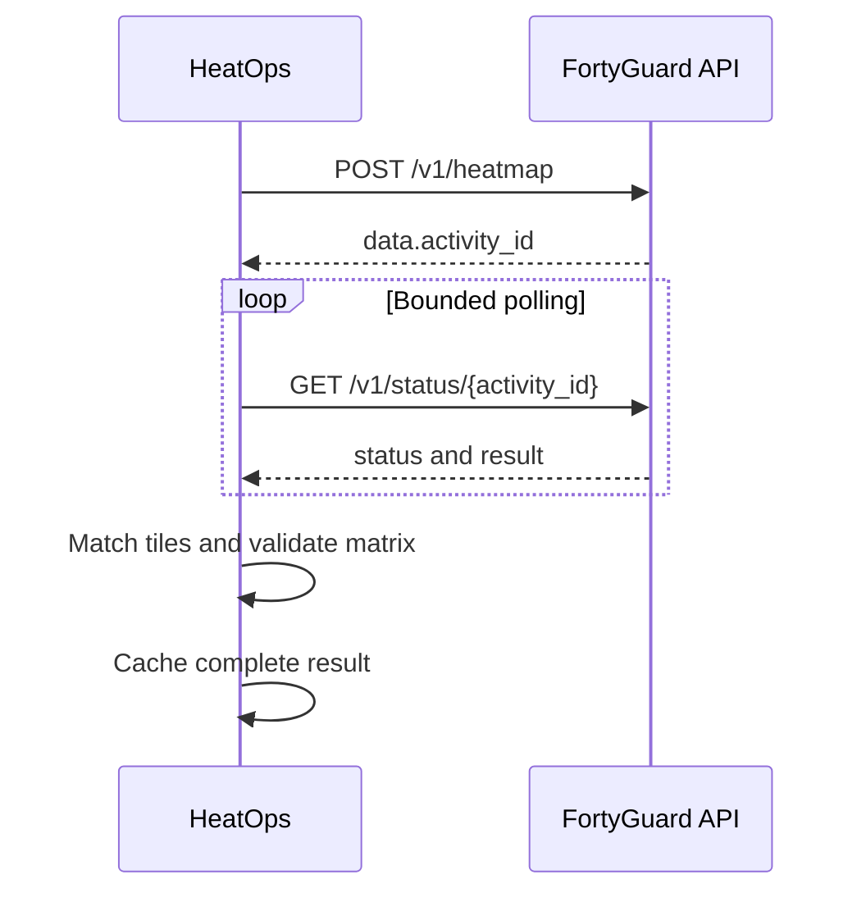

# FortyGuard API integration

This document records exactly how the HeatOps codebase uses FortyGuard. It is
both implementation documentation and the API-usage evidence for the
hackathon submission.

## Configuration

| Variable | Required | Default |
| --- | --- | --- |
| `FORTYGUARD_API_KEY` | Yes for live mode | None |
| `FORTYGUARD_BASE_URL` | No | `https://api.fortyguard.com` |

The HTTP client sends the key in the `api-key` header. Local development loads
`.env`; Streamlit can also read `.streamlit/secrets.toml`. Neither secret file
is committed.

## Request lifecycle



For every requested time slot,
`src/heatops/integrations/temperature_service.py` calls:

1. `FortyGuardClient.create_heatmap(...)`.
2. `FortyGuardClient.wait_for_result(...)`.
3. `match_jobs_to_temperatures(...)` on the returned GeoJSON features.

One AOI is reused across the slots. The resulting values are assembled into a
`job_id × time_slot` temperature matrix for the optimizer.

## Heatmap request

`POST /v1/heatmap` receives this shape:

```json
{
  "polygon_aoi": {"type": "FeatureCollection", "features": []},
  "date_time": {
    "start_date": "2026-08-24",
    "start_time": "08:00",
    "filter_type": 1
  },
  "granularity": 100
}
```

The real `polygon_aoi` is a padded bounding polygon derived from all job
coordinates. `granularity` is an integer in meters. HeatOps requires a
non-empty `data.activity_id` in the response.

## Status polling and result shape

`GET /v1/status/{activity_id}` is polled until:

- `completed` or `succeeded`: `data.result` must be an object;
- `failed` or `error`: HeatOps raises an activity error with available detail;
- the maximum number of polls is reached: HeatOps raises a timeout error.

The temperature service expects completed output to contain
`map_data.features`. Each feature must be an object. Spatial matching uses job
latitude/longitude and feature geometry; a time slot is rejected if any job
has no covering tile.

## Validation contract

A matrix enters optimization only when:

- every requested job ID exists;
- every requested time slot exists for every job;
- every value is a finite number;
- time labels are valid and unique.

This completeness check matters because silent gaps could bias the schedule
toward a job or time that simply lacked data.

## Retries, cache, and fallback

The client uses a 30-second request timeout by default. Network failures and
HTTP `429`, `500`, `502`, `503`, and `504` responses are retried up to three
attempts with exponential backoff. Activity polling is also bounded (default:
120 checks, five seconds apart).

Only a complete, validated live matrix is written to `data/cache/`. Cache files
contain the matrix plus requested date, data date, time slots, granularity,
generation time, activity IDs, and cache path. Invalid or incomplete cache
files are skipped.

The service fallback order is:

1. live FortyGuard result;
2. latest compatible validated cache;
3. for the dashboard, the bundled repository snapshot.

The UI always labels the active source. An API failure cannot silently present
the snapshot as live data.

## Reproducible Phoenix snapshot

The default demo does not fabricate temperatures or require live API access.
It uses the repository's existing FortyGuard ingestion output, copied without
alteration to `data/scenarios/phoenix-demo/temperature_matrix.json`.

Recorded provenance:

| Field | Value |
| --- | --- |
| Provider | FortyGuard |
| Data date | 2026-08-24 |
| Time range | 08:00–19:00 hourly |
| Granularity | 100 m |
| SHA-256 | `e6080bde546f89b238b43a85826e51d11dc6f03bd3694835e4281dc0f134eab2` |

`tests/test_phoenix_demo_scenario.py` verifies both the hash and the byte-for-byte
scenario copy.

## Test coverage

- `tests/test_fortyguard_client.py`: request schema, headers, polling, retries,
  failures, malformed responses, and timeouts.
- `tests/test_temperature_matcher.py`: GeoJSON tile-to-job matching.
- `tests/test_temperature_service.py`: end-to-end orchestration, validation,
  cache writes, fallback, and unavailable-data behavior.
- `tests/test_fetch_temperature_script.py`: command-line fetch behavior.
- `tests/test_app_smoke.py`: dashboard source selection and safe snapshot fallback.

CI uses fake clients and the repository snapshot; it never requires an API key
or consumes FortyGuard quota.
