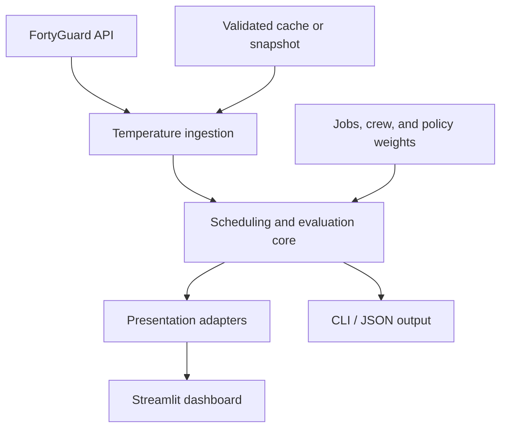

# HeatOps architecture

HeatOps is organized as a small decision-support system: ingest hyperlocal
temperature data, convert operational inputs into a constrained scheduling
problem, compare the result with a fair baseline, then render evidence without
putting business logic in the UI.

## System context

The core remains presentation-neutral. Streamlit consumes immutable records
from `src/heatops/presentation.py`; the CLI serializes the same evaluation
models. This keeps demo work from changing optimizer behavior.

## Component boundaries

| Layer | Primary files | Responsibility |
| --- | --- | --- |
| Domain | `src/heatops/domain/` | Validated jobs, workers, weights, time helpers, and shared scheduler configuration |
| Integration | `src/heatops/integrations/` | FortyGuard HTTP contract, AOI generation, tile matching, matrix validation, caching, and fallback |
| Optimization | `src/heatops/optimization/` | Heat Load calculation, policy presets, fair baseline, and deterministic CP-SAT model |
| Evaluation | `src/heatops/evaluation/` | Comparable schedule metrics, before/after records, and explanations |
| Presentation | `src/heatops/presentation.py` | UI-neutral timelines, map markers, curves, metric cards, and trade-off points |
| Interfaces | `app.py`, `src/heatops/cli.py` | Interactive dashboard and scriptable text/JSON output |

Dependencies point inward: interfaces depend on presentation and evaluation;
the optimizer does not import Streamlit, Pandas, Altair, or PyDeck.

## End-to-end data flow

1. Load jobs, crews, scenario metadata, and a temperature matrix.
2. When live mode is requested, build a padded GeoJSON AOI from job locations.
3. Request and poll one FortyGuard heatmap for each hourly time slot.
4. Match each job coordinate to a heatmap feature, validate every job/time
   value, and cache only a complete matrix.
5. Build the operations-first baseline using zero heat weight.
6. Build the selected HeatOps schedule with preset or custom weights.
7. Calculate both schedules' Heat Load, delay, threshold minutes, idle time,
   peak temperature, and job movements.
8. Convert the comparison to presentation records for the dashboard.

If live retrieval fails, the temperature service first checks a validated cache.
The dashboard adds a final deterministic fallback to the bundled snapshot and
shows the active source to the viewer.

## Scheduling model

For each job, HeatOps creates a candidate for every allowed start time on a
15-minute grid. Each candidate has a Boolean selection variable and an optional
fixed-size interval.

### Hard constraints

- Exactly one candidate is selected for every job.
- A job starts no earlier than its time window or crew shift.
- A job ends no later than its deadline or crew shift.
- The selected crew has every required skill.
- Selected job intervals do not overlap.

All policy modes, including the baseline, use these same constraints.

### Operational Heat Load Score

For a candidate that starts job $j$ at time $s$, the modeled Heat Load is:

$$
H_{j,s} = I_j \sum_{i \in \mathcal{I}(j,s)}
          \max(T_{j,i} - \tau, 0)
          \frac{\Delta t_i}{60}
$$

Here, $I_j$ is the job's physical-intensity multiplier, $T_{j,i}$ is the
interpolated temperature during interval $i$, $\Delta t_i$ is the interval
length in minutes, and $\tau = 32\,^{\circ}\mathrm{C}$ is the runtime threshold.
The schedule score is the sum of the selected jobs' candidate scores.

This is a transparent operational planning score. It is not WBGT, a medical
risk model, a regulatory limit, or a prediction of injury.

### Objective

Each candidate's Heat Load and priority-weighted delay are independently
normalized over the scenario's candidate ranges. Conceptually, HeatOps
minimizes:

$$
\min \sum_{c \in \mathcal{C}} x_c
     \left(w_h \widehat{H}_c + w_d \widehat{D}_c\right)
$$

Here, $c$ is a candidate job/start-time pair, $x_c$ is 1 when that candidate is
selected, $\widehat{H}_c$ and $\widehat{D}_c$ are normalized Heat Load and
priority-weighted delay, and $w_h$ and $w_d$ are the selected policy weights.

Integer scaling makes the objective compatible with CP-SAT. A small,
deterministic start-index tie-break and fixed solver seed make results stable
for a demo and test suite.

### Fair baseline

`build_baseline_schedule` invokes the same optimizer with heat weight `0` and
delay weight `1`. Temperature is evaluated only after the baseline schedule is
chosen. This controls for feasibility logic: the comparison changes the
decision policy, not the scheduling rules.

## Scenario and provenance

The Phoenix demo has two distinct input classes:

| Input | Status | Source |
| --- | --- | --- |
| Hourly hyperlocal temperatures | Traceable data snapshot | Existing FortyGuard ingestion output, copied byte-for-byte into the scenario |
| Jobs, locations, windows, priorities, skills, intensity | Demo assumptions | Explicit JSON fixtures for the hackathon narrative |
| Worker shift and skills | Demo assumptions | Explicit JSON fixture |
| Threshold and slot size | Model configuration | `SchedulerConfig` and scenario metadata |

`data/scenarios/phoenix-demo/metadata.json` records the snapshot SHA-256,
source date, provider, granularity, AOI, time slots, and disclaimer. Tests verify
the checksum and scenario copy.

## Reliability decisions

- HTTP requests have timeouts, bounded retries, and exponential backoff for
  transient status codes.
- Asynchronous activities have bounded polling and explicit failed/timeout
  exceptions.
- Responses are schema-checked before use.
- A matrix is accepted only when every requested job/time value is finite.
- Cache files include source metadata and are revalidated when loaded.
- API keys come from environment or Streamlit secrets and are never serialized.
- Tests use fake sessions/clients; CI never consumes a live API quota.

## Extension seams

The current single-crew model is deliberate hackathon scope. Later work can add
multiple crew assignment, travel time, breaks, rolling replanning, or persistent
scenario storage behind the existing domain and evaluation boundaries. Those
extensions are intentionally outside the current prototype scope.
